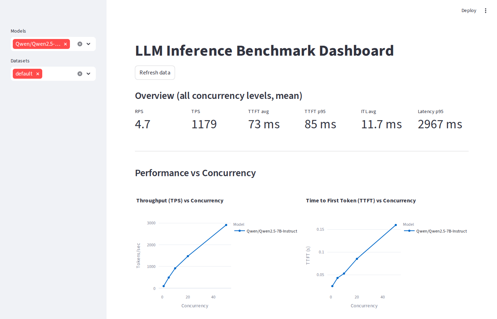
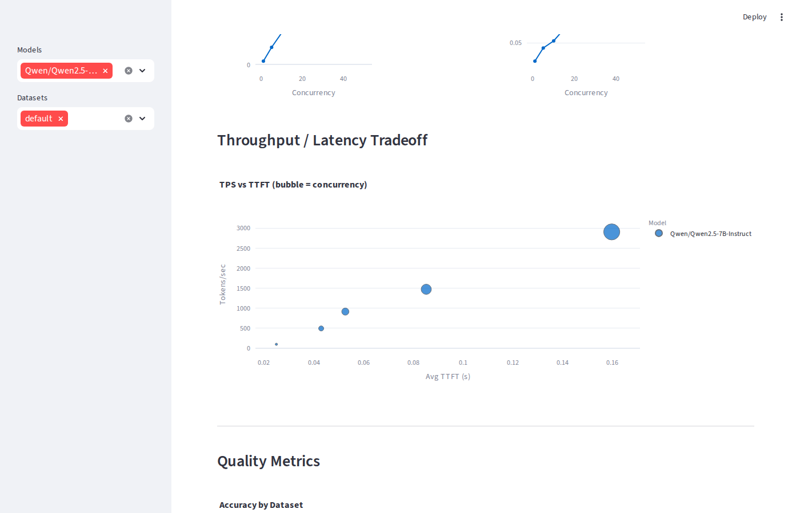
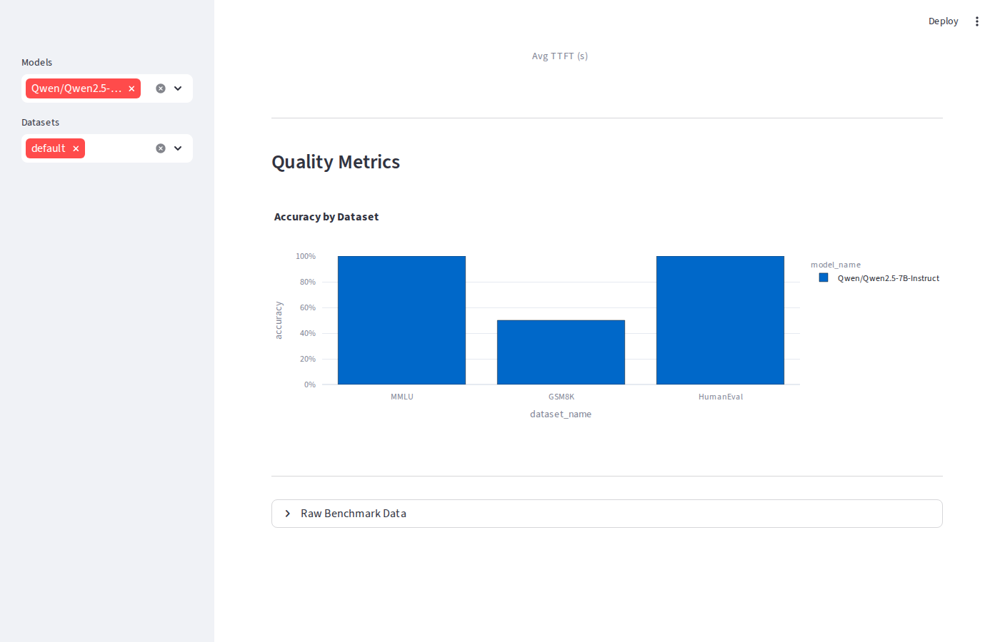
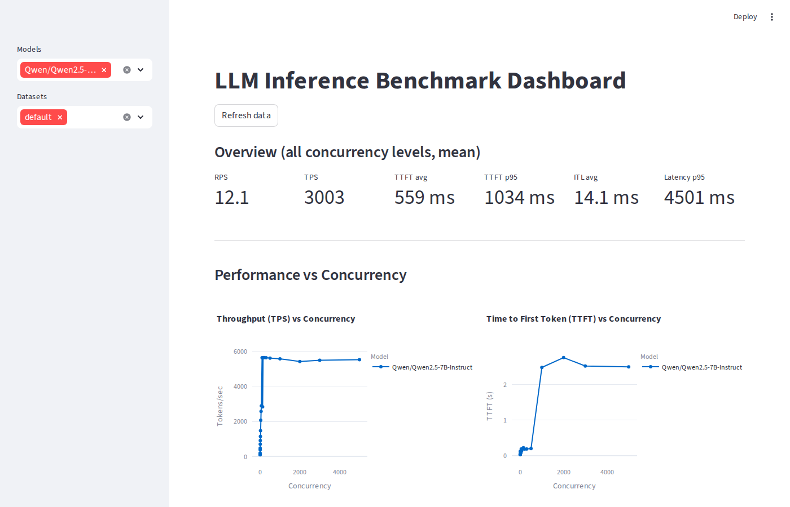
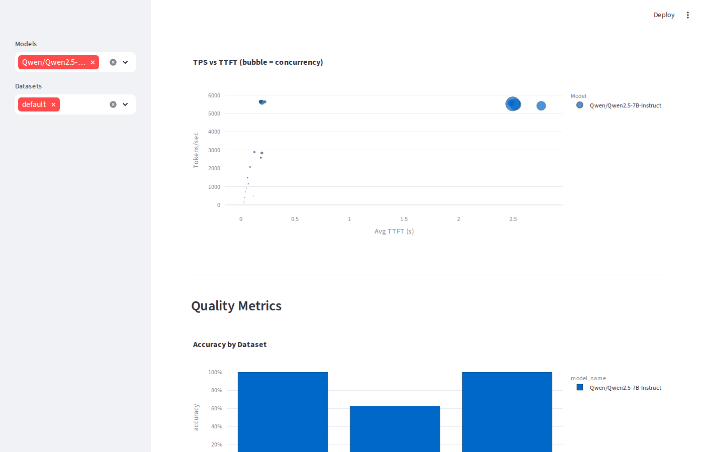
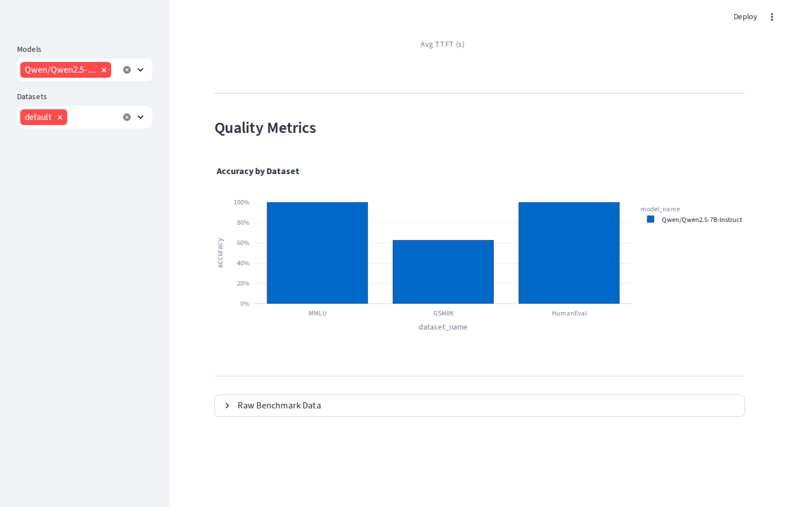

# vLLM + SGLang + TRT-LLM Benchmarking Platform

End-to-end LLM benchmarking: serving performance (RPS, TPS, TTFT, ITL) + quality
evaluation (MMLU, GSM8K, HumanEval) with a Streamlit dashboard. Supports **vLLM**,
**SGLang**, and **TensorRT-LLM** — any OpenAI-compatible endpoint works.

---

## Dashboard

### vLLM — Overview & KPIs


### vLLM — Throughput / Latency Tradeoff


### vLLM — Quality Metrics


> **vLLM results** — `Qwen/Qwen2.5-7B-Instruct` on RTX 5090.
> GPU ceiling: **~5,650 TPS** (queue-saturated). Practical saturation: **~2,917 TPS** at c=64. Quality: MMLU **100%**, HumanEval **100%**, GSM8K **50%**.

---

### SGLang — Overview & KPIs


### SGLang — Throughput / Latency Tradeoff


### SGLang — Quality Metrics


> **SGLang results** — `Qwen/Qwen2.5-7B-Instruct` on RTX 5090.
> GPU ceiling: **~5,640 TPS** (queue-saturated). Practical saturation: **~2,887 TPS** at c=64. Quality: MMLU **100%**, HumanEval **100%**, GSM8K **62.5%**.

---

## Project structure

```
.
├── benchmark/
│   ├── metrics.py          # RequestResult, BenchmarkMetrics, compute_metrics()
│   └── load_test.py        # Async concurrent load tester (streaming)
├── evaluation/
│   └── guidellm_runner.py  # GuideLLM wrapper + direct-API fallback evaluator
├── dashboard/
│   ├── app.py              # Streamlit dashboard
│   └── data_store.py       # Parquet/CSV persistence layer
├── docs/images/            # Dashboard screenshots
├── data/                   # Auto-created; stores .parquet + .csv results
├── main.py                 # Pipeline entry point (CLI)
└── requirements.txt
```

---

## Quick start

### 1. Install dependencies

```bash
python -m venv .venv && source .venv/bin/activate
pip install -r requirements.txt
```

### 2a. Try with demo data (no GPU required)

```bash
python main.py --demo
streamlit run dashboard/app.py
```

### 2b. Run against a live vLLM server

**Start vLLM:**

```bash
# Qwen2.5-7B (RTX 5090 — use FlashInfer backend)
vllm serve Qwen/Qwen2.5-7B-Instruct \
  --host 0.0.0.0 --port 8000 \
  --attention-backend FLASHINFER

# Llama single GPU
vllm serve meta-llama/Llama-3.1-8B-Instruct \
  --port 8000

# Multi-GPU (tensor parallelism)
vllm serve meta-llama/Llama-3.1-70B-Instruct \
  --tensor-parallel-size 4 \
  --port 8000
```

### 2c. Run against a live SGLang server

**Start SGLang:**

```bash
python -m sglang.launch_server \
  --model-path Qwen/Qwen2.5-7B-Instruct \
  --host 0.0.0.0 --port 8000
```

### 2d. Run against TensorRT-LLM

**Prerequisites (one-time system setup — requires CUDA 12.9+):**

```bash
# 1. Install TRT-LLM and dependencies
pip install tensorrt-llm --extra-index-url https://pypi.nvidia.com
pip install hf_transfer

# 2. Install OpenMPI (required by mpi4py) and CUDA 13 cuBLAS
apt-get install -y libopenmpi-dev openmpi-bin libcublas-13-0 cuda-toolkit-12-9

# 3. Point the /usr/local/cuda symlink at your toolkit
update-alternatives --set cuda /usr/local/cuda-12.9
```

**Start TRT-LLM server (TRT engine with FlashInfer):**

```bash
export LD_LIBRARY_PATH=/usr/local/cuda-13.0/targets/x86_64-linux/lib:$LD_LIBRARY_PATH

trtllm-serve serve Qwen/Qwen2.5-7B-Instruct \
  --host 0.0.0.0 \
  --port 8000 \
  --backend tensorrt \
  --max_batch_size 64 \
  --max_num_tokens 4096
```

On first run, TRT-LLM compiles a TensorRT engine for your GPU (~5 min), then
runs CUDA graph warmup for batch sizes 1–64. Wait for:
`INFO: Application startup complete.`

> **Note on CUDA < 12.9 / Blackwell:** If you are on CUDA 12.8, drop `--backend tensorrt` and add `--extra_llm_api_options /tmp/trtllm_extra.yaml` with `disable_flashinfer_sampling: true`. This runs the PyTorch backend at reduced throughput. See `RESULTS.md` for the performance difference.

> **Verify model name before benchmarking:** `curl http://localhost:8000/v1/models`

**Run benchmarks:**

```bash
# Full pipeline (load test + quality eval)
python main.py \
  --model Qwen/Qwen2.5-7B-Instruct \
  --base-url http://localhost:8000 \
  --concurrency 1,5,10,20,50 \
  --num-requests 50

# Load test only
python main.py --no-eval

# Evaluation only
python main.py --no-bench --eval-datasets mmlu,gsm8k

# Clear previous results and re-run
python main.py --clear
```

**Launch dashboard:**

```bash
streamlit run dashboard/app.py \
  --server.address 0.0.0.0 \
  --server.port 8501 \
  --server.fileWatcherType none \
  --server.enableCORS false \
  --server.enableXsrfProtection false
# → open http://localhost:8501
```

---

## Benchmark results — Qwen/Qwen2.5-7B-Instruct (RTX 5090)

Three backends benchmarked: vLLM (`--attention-backend FLASHINFER`), SGLang, and TRT-LLM (`--backend tensorrt`, CUDA 12.9, FlashInfer enabled).

### Three-way comparison — baseline sweep (concurrency 1 → 50, 50 req each)

| Concurrency | vLLM TPS | SGLang TPS | TRT-LLM TPS | vLLM TTFT | SGLang TTFT | TRT-LLM TTFT |
|---|---|---|---|---|---|---|
| 1  | 101   | 102   | 93    | 25 ms  | 33 ms  | 22 ms  |
| 5  | 496   | 479   | 458   | 43 ms  | 118 ms | 33 ms  |
| 10 | 917   | 913   | 896   | 53 ms  | 52 ms  | 48 ms  |
| 20 | 1,474 | 1,479 | 1,477 | 85 ms  | 63 ms  | 83 ms  |
| 50 | 2,907 | 2,576 | 4,063 | 160 ms | 186 ms | 191 ms |

> TRT-LLM pulls ahead at c=50 (**4,063 TPS** vs vLLM 2,907, SGLang 2,576) due to compiled CUDA kernels, CUDA graph capture, and fused MLP layers. At lower concurrency (c=1), TRT-LLM also delivers the lowest TTFT (22 ms).

See [`RESULTS.md`](RESULTS.md) for the full three-way comparison across all test suites.

---

### vLLM detailed results (three test suites)

### vLLM — Baseline sweep (concurrency 1 → 50, 50 req each)

| Concurrency | RPS | TPS | TTFT avg | TTFT p95 | ITL avg | Latency p95 |
|---|---|---|---|---|---|---|
| 1 | 0.41 | 101 | 25 ms | 31 ms | 9.9 ms | 2,468 ms |
| 5 | 2.00 | 496 | 43 ms | 53 ms | 10.0 ms | 2,512 ms |
| 10 | 3.70 | 917 | 53 ms | 64 ms | 10.7 ms | 2,710 ms |
| 20 | 5.93 | 1,474 | 85 ms | 109 ms | 11.1 ms | 2,881 ms |
| 50 | 11.71 | 2,907 | 160 ms | 170 ms | 16.6 ms | 4,263 ms |

### vLLM — Fine-grained sweep — finding the saturation point (concurrency 1 → 128, 50 req each)

| Concurrency | RPS | TPS | TTFT avg | TTFT p95 | Latency p95 |
|---|---|---|---|---|---|
| 1 | 0.41 | 101 | 24 ms | 30 ms | 2,467 ms |
| 2 | 0.81 | 201 | 30 ms | 32 ms | 2,475 ms |
| 4 | 1.54 | 383 | 39 ms | 44 ms | 2,495 ms |
| 8 | 2.85 | 708 | 48 ms | 65 ms | 2,530 ms |
| 16 | 4.71 | 1,169 | 72 ms | 82 ms | 2,732 ms |
| 32 | 8.70 | 2,158 | 103 ms | 121 ms | 2,909 ms |
| **64** | **11.74** | **2,917** | **146 ms** | **163 ms** | **4,255 ms** |
| 128 | 11.61 | 2,882 | 185 ms | 195 ms | 4,300 ms |

> **Saturation point: c=64 (~2,917 TPS).** Adding more users yields no throughput gain — the GPU is fully utilised. Marginal TPS actually regresses at c=128 as queue overhead grows.

### vLLM — Overload test (concurrency 100 → 500, 100 req each)

| Concurrency | RPS | TPS | TTFT avg | TTFT p95 | Latency p95 | Errors |
|---|---|---|---|---|---|---|
| 100 | 22.3 | 5,550 | 264 ms | 294 ms | 4,463 ms | 0 |
| 150 | 22.5 | 5,590 | 249 ms | 277 ms | 4,434 ms | 0 |
| 200 | 22.3 | 5,529 | 244 ms | 272 ms | 4,471 ms | 0 |
| 300 | 22.5 | 5,584 | 227 ms | 262 ms | 4,442 ms | 0 |
| 500 | 22.8 | 5,658 | 174 ms | 206 ms | 4,379 ms | 0 |

> **Zero errors at all concurrency levels.** vLLM's continuous batching absorbs extreme load gracefully. Higher TPS here (~5,650) vs. the fine-grained sweep (~2,917) is because a perpetually-full queue lets vLLM pack every decode step to maximum batch size, roughly doubling throughput compared to bursty low-request tests.

### vLLM — Extreme overload (concurrency 1,000 → 5,000, 200 req each)

| Concurrency | RPS | TPS | TTFT avg | TTFT p95 | Latency p95 | Errors |
|---|---|---|---|---|---|---|
| 1,000 | 22.2 | 5,512 | 2,538 ms | 4,788 ms | 8,970 ms | 0 |
| 2,000 | 22.1 | 5,485 | 2,542 ms | 4,778 ms | 8,956 ms | 0 |
| 3,000 | 22.1 | 5,491 | 2,555 ms | 4,799 ms | 8,995 ms | 0 |
| 5,000 | 22.1 | 5,491 | 2,548 ms | 4,800 ms | 9,013 ms | 0 |

> **vLLM never hard-fails — it queues everything.** The real breaking point is latency, not errors:
> - TTFT explodes from **~174 ms** (c=500) → **~2,538 ms** (c=1,000) — a **14× jump**
> - Latency p95 doubles from **~4.4 s** → **~9.0 s** between c=500 and c=1,000
> - TPS stays flat at ~5,500 regardless of queue depth — the GPU is the ceiling
>
> **Practical SLA boundary: c ≈ 500–1,000.** If your target is TTFT < 500 ms, the system degrades well before requests are dropped. To enforce hard limits, set `--max-num-seqs` on the vLLM server or use a client-side timeout.

### Quality evaluation

| Dataset | Metric | vLLM | SGLang | TRT-LLM |
|---|---|---|---|---|
| MMLU | Accuracy | 100% | 100% | 100% |
| GSM8K | Exact Match | 50% | 62.5% | **87.5%** |
| HumanEval | pass@1 | 100% | 100% | 100% |

---

## Metrics reference

| Metric | Formula | Unit |
|--------|---------|------|
| **RPS** | successful_requests / wall_time | req/s |
| **TPS** | total_output_tokens / wall_time | tok/s |
| **TTFT** | mean(first_token_ts − start_ts) | seconds |
| **ITL** | mean((end_ts − first_token_ts) / (tokens − 1)) | s/token |

All metrics are computed per concurrency level. Percentile variants (p50/p95/p99)
are stored for TTFT and latency.

---

## GuideLLM

When `guidellm` is installed it is used as the primary evaluator:

```bash
pip install guidellm
```

Without it, the platform falls back to a built-in direct-API evaluator using
curated sample questions from MMLU, GSM8K, and HumanEval — sufficient for
relative model comparisons.

---

## Dashboard sections

1. **Overview KPIs** — RPS, TPS, TTFT avg/p95, ITL, latency p95
2. **Performance Graphs** — TPS/TTFT vs concurrency
3. **Tradeoff Scatter** — TPS vs TTFT (bubble = concurrency level)
4. **Quality Metrics** — accuracy/exact-match/pass@1 per dataset
5. **Raw Data** — filterable tables + CSV download

---

## Exported files

After each run, results are written to `data/`:

- `benchmark_results.parquet` / `.csv` — performance metrics
- `evaluation_results.parquet` / `.csv` — quality evaluation scores
